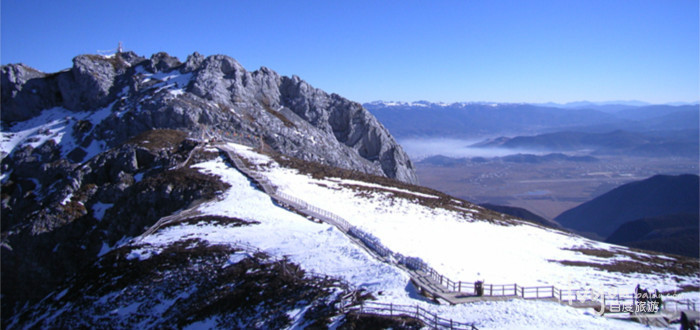
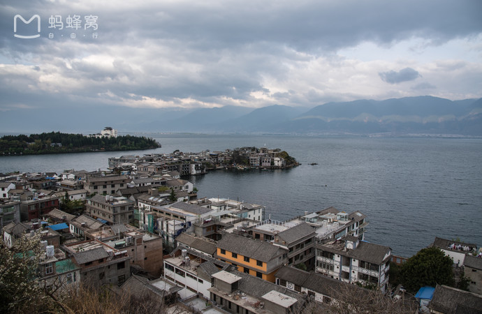

# 女神的七彩云南

* 旅行中唯一一件要做的事情就是要把你的心找到，旅行令你回到你自己原本的样子，做任何事情都会有全新的意义，这样的你才会觉得快乐。
* 不为其他，只为了在那里，可以做最真实的自己，找到纯真的快乐。

## 天气

* [丽江 天气预报30天](http://lijiang.tianqi.com/30/)
* [大理 天气预报30天](http://dali1.tianqi.com/30/)
* 气温 丽江秋天天气(9月-11月)：气温约5℃-23℃，雨天晴天阴天各占三分之一。
* 穿衣 早上10点至下午5点长衣或T恤配长裤/下午6点至第二天早上9点加外套或薄毛衣。出门看天，如多乌云建设带上雨具或防水冲锋衣。
* 紫外线强、紫外线强、紫外线强
* 天气干燥

## 物品

* 防晒霜、护肤品、太阳伞、帽子必备 （云南的气温不高，就是那里的太阳喜欢给女神抹黑，手臂彤红彤红的）^_^
* 雨具
* 墨镜
* 鞋子
* 防风衣
* 药品：感冒药，胃药，创可贴，风油精/双飞人（云南蚊虫多）、担心有高原反应的需提前10天服用红景天
* 日用品：湿巾、洗漱品（毛巾、牙刷、牙膏）、衣服（薄的羽绒服）、内衣裤、袜子、餐巾纸 （建议在淘宝上买一次的袜子和内衣裤）
* 背包或者旅行箱

## 行程安排

* D1
* D2
* D3
* D4
* D5

## 丽江

* 美食
    - 阿安酸奶 地点：五一街上有2家，七一街大石桥有1家
    - 
    - 酸梅汤 十月酸梅汤的铺子比较地道
    - 丽江粑粑
    - 
    - 鸡豆凉粉 地点：五一街上有一家叫“88号小吃店”的
    - 
    - 腊排骨 地点：象山市场比较出名的就是入口处的钰洁腊排骨 一锅60块，2人差不多80块， 4人差不多100块。出古城口打个车7块就到象山市场了。
    -  
    - 野生菌 东巴谷野生菌，火锅，新城花马街
    - 洋芋鸡 新城的“太安洋芋鸡”最出名了，出古城口打个车7块就到了
    -  
    - 三川火腿 【特色美食】 野山药火腿鸡，火锅，古城南门停车场旁。价格适中。吃之前先喝碗汤，它的汤味道很好火锅用本地乌鸡和山药一起炖好，火腿美味
    - 三文鱼 新城花马街的彩虹三文鱼，38元一斤，算是比较实惠的了。还有古城秋月阁餐吧，它们家的清酒芥末都很正宗，鱼也很新鲜，是古城比较推介的一家
    -  
    - 哈记牛肉 地点：新义街把口第三家/忠义市场南门向西路北的永胜清真牛肉
    - 酥油茶 价格：15-20元 当地人开的大街小巷的早点铺都有
    - 拉市鲫鱼 忠义市场南门坐车6块，拉市海再往前3公里左右路南，15一斤，一般3斤5个人可过瘾,另外再加上正宗卤水豆腐，好吃的不得了
    - 纳西烤肉 丽江几乎各个饭店小餐馆都可以做，而且做法也一致
    -  

* 丽江古城 [大研古城]
    - 门票：古城建设费80元，但不去景点可以不交
    - 景点级别：AAAAA级
    - 著名景点：木府，万古楼，大石桥，白马龙潭等
    - 
   
* 丽江木府 
    - 门票：60元/位
    - 开发时间：09:00~17:00
    - 景点级别：国家AAAA级旅游景区
    - 景点：石牌坊、万卷楼、三清殿、玉音楼、议事厅
    - [淘宝链接](https://s.taobao.com/search?q=%E4%B8%BD%E6%B1%9F%E6%9C%A8%E5%BA%9C&imgfile=&js=1&stats_click=search_radio_all%3A1&initiative_id=staobaoz_20170726&ie=utf8)
    -  

* [玉龙雪山](https://lvyou.baidu.com/yulongxueshan/jingdian)
    - [淘宝链接](https://s.taobao.com/search?q=%E7%8E%89%E9%BE%99%E9%9B%AA%E5%B1%B1&imgfile=&js=1&stats_click=search_radio_all%3A1&initiative_id=staobaoz_20170726&ie=utf8)
    - 建议淘宝买个本地团
    - 玩点：
        * 蓝月谷 玉龙雪山东麓，前称为人们熟知的“白水河
        * 玉柱擎天 玉龙雪山主峰南麓，海拔2800米左右，这里是极目纵览丽江山川风光的好地方
        * 扇子陡
        * 甘海子
    - 交通 
        * 从丽江驱车50分钟左右到达玉龙雪山了
        * 红太阳广场面包车20元一位送到停车场，即上索道的地方。
    - 特别提示
        * 九月的云南也是比较凉爽的了，去玉龙雪山的话可以看风景，因为气温还不够低，所以看不到雪哦！做好其他准备哦
        * 
    - 玉龙雪山装备
        * 衣物：厚实点的衣物，冲锋衣也是必备的（雪山温度低，多带件厚衣服总不是坏事）
        * 背包：小背包，出去玩的时候背点鸡零狗碎的玩意儿（人肉骡子，伤不起，买点巧克力，矿泉水之类的小零食）
        * 路餐：士力架、巧克力、牛奶糖、牛肉干（强烈推荐，确实能横扫饥饿，轻便小巧，方便携带，最好是之前就买好，雪山东西有点贵额）
        *其它：墨镜、有沿帽、魔术头巾、围巾（丽江真的超级无敌干燥，没有太阳时紫外线也是超级强大，所以出门一定做好防晒护理）
    - 三个索道 价格仅供参考
        * 大索道（又叫“冰川索道”）票价已经涨到172元/人（来回双程）可抵达海拔4500米的高度
        * 小索道（也叫“云杉坪索道”） 票价59元/人（双程），可抵达海拔3200米的云杉坪
        * 牦牛坪索道，62元/人（双程），可抵达海拔3700多米的牦牛坪
    - 
    - 
    - 蓝月谷 
    - 

* 拉市海
    - 门票：30元
    - 玩点：
        * 骑马走茶马古道
        * 拉市海湿地公园/划船
    - 地点：拉市海位于丽江城西面10公里处的拉市坝中部
    - 出租车：夏利，到拉市海单程价15元（包接30元），（20包车）要求到拉市海南或海北，海北接近湖内小岛，海南则为拉市海度假村。指云寺单程25元。包车价每天80元。
    - 公车：忠义市场乘30路公交车至海北（美泉一带），半小时一趟；乘31、32路公交车到海东、海南（湿地公园）一带，以前客货两用的面包车已经被换成1元/人的公交车。
    - [淘宝链接](https://s.taobao.com/search?q=%E6%8B%89%E5%B8%82%E6%B5%B7&imgfile=&commend=all&ssid=s5-e&search_type=item&sourceId=tb.index&spm=a21bo.50862.201856-taobao-item.1&ie=utf8&initiative_id=tbindexz_20170726)
    - 

* [泸沽湖](https://lvyou.baidu.com/luguhu/jingdian)
    - [淘宝可以买本地团](https://s.taobao.com/search?ie=utf8&initiative_id=staobaoz_20170726&stats_click=search_radio_all%3A1&js=1&imgfile=&q=%E6%B3%B8%E6%B2%BD%E6%B9%96%E4%B8%80%E6%97%A5%E6%B8%B8&suggest=0_2&_input_charset=utf-8&wq=%E6%B3%B8%E6%B2%BD%E6%B9%96&suggest_query=%E6%B3%B8%E6%B2%BD%E6%B9%96&source=suggest&sort=price-asc)
    - 玩点：
        * 泸沽三岛 人们往往慕名远道来游，这里绝妙的景致引人惊叹，美丽得无法用语言形容。可以骑马或步行，沿湖边走一走，欣赏泸沽湖的湖光山色。
        * 
        * 永宁土知府衙署  纳西民族风格的建筑，见证云南历经元明清三代的土司制度
        * 
        * 洛洼码头 无门票，全天开放
        * 

* 丽江酒吧 你懂的～_~
    - 清吧 Bamboo班布 地点：大水车附近
    - 酒吧一条街 位置：东大街的上部一直延续到四方街，五一街和南门那边

* 住宿

## 大理

* 美食
    - [舌尖上的大理](http://touch.travel.qunar.com/smartlist/5599912)
    - 雕梅扣肉 雕梅是大理的有名小食，肥而不腻，香甜入味。
    - 
    - 无量山翅包饭 以“高耸入云不可跻，面大不可丈量之意”得名，金庸的《天龙八部》让无量山享誉海内外。
    - 
    - 饵块/饵丝 为云南特有，是大理最著名的特色小吃之一。
    - 
    - 黄焖鸡 以大理永平县的最出名，也号称“滇西一只鸡”、“滇西名菜头牌”，香气袭面而来，吃起来竟然一点不油腻，好吃到心坎里去了！
    - 
    - 卷蹄 肉质含香，味道鲜美，鲜而不腻，这种食物还易于贮存，始终风味犹存。
    - 
    - 凉鸡米线 主要就是由鸡丝和米线制成，鸡丝需要煮熟，以核桃酱和小粉做成卤汁，搭配着辣椒汁和蒜末，为了美观通常还会撒些葱花和芝麻，吃起来微辣，恰好的酸味，鸡肉的嫩和米线的香混为一体，极为爽口，很快就能将一碗滑下肚。
    - 
    - 乳扇 云南十八怪”有一怪为“牛奶做成扇子卖，乳扇其实是一种奶酪，由牛奶制成，半透明状，光滑油润，片状成卷，吃法很多种，生吃、干吃、凉拌、烧烤、油炸着吃皆可，可与云腿一起用于烹调，也可作为可口的下酒菜。在大理随处可见，它的美味可口早已深入人心。
    - 
    - 砂锅鱼 在大理相当有名，鱼头鱼尾露在砂锅外，再将鸡汤、鸡肉、火腿、豆腐等倒入，加以各种调料，慢火烹炖。趁热享用，鱼味鲜美，香气扑鼻，回味无穷啊。
    - 
    - 大理酸辣鱼 大理白族待客最爱做的一道菜，酸、微甜、辣构成的奇妙的味觉体验。
    - 
    - 大理生皮 生皮选材与制作都特别讲究，上好的生皮选取猪后腿肉和里脊、腰脊作为主料，用稻草或麦秸烧火烤猪的外皮，至猪皮表层发黄，然后才用水洗净，伴上佐料生吃。
    - 

* [洱海](http://www.mafengwo.cn/poi/956.html)
    - [博文](http://qq.mafengwo.cn/travels/info.php?id=6516842)
    - 交通 从古城去洱海步行即可到；乘11路公交车在龙山市场站下车可达；打的或乘马车（事先与车主谈好价钱，私人巴士1元/人，马车可坐10人左右，约4元/人）；下关到洱海码头，可乘6路车或的士
    - 
    - 门票 南诏风情岛50元/人，玉叽岛12.5元/人，严家民居62元/人，严家大院20元/人；洱海游船142元/人（含南诏风情岛、天镜阁、小普陀、金梭岛等）
    - 特别提示
        * 在才村码头 （在大理古城附近 距离古城约6KM，坐C2路公交抵达），桃源村（在喜洲镇附近）都比较适合看日出 双廊则比较适合看日落
        * 日出时间 每天不是一样的 现在开始到夏至日（6月21日）之前，日出时间会一天比一天早，今天（4月7日）日出时间是7:03分 日落时间是19；38分 （近期的话建议6:30分 左右提前收拾好等候）不同季节、地区 、角度会有浮动。建议您入住之后询问一下当地客栈老板，另外看日出也跟天气有关，您也可以提前一天预约店家的小船，10元/人，坐船看日出。
        * 如果是在双廊住宿的话，看日出可能不是很方便的，如果要看日出，只能是在双廊乘坐小船在洱海中看日出，其实泛舟洱海看日出也是不错的选择；
        * 日出的时间大概是7点4分左右，所以建议是在6点40分之前到洱海边看日出即可；
    - 
    - 

* [大理古城](http://www.mafengwo.cn/poi/17043.html)
    - 简介 大理古城又名叶榆城、紫禁城、中和镇。古城其历史可追溯至唐天宝年间，南诏王阁逻凤筑的羊苴咩城(今城之西三塔附近)，为其新都。现在的古城始建于明洪武十五年(公元1382年)，古城外有条护城河，古城四周有城墙，东、西、南、北各设一门，均有城楼，四角还有角楼。解放初，城墙均被拆毁，1982年，重修南城门，门头“大理”二字是集郭沫若书法而成。城内街道为典型的棋盘式布局，街巷间有一些老宅，也仍可寻昔日风貌，庭院里花木扶疏，鸟鸣声声，户外溪渠流水淙淙。“三家一眼井，一户几盆花”的景象依然。
    - 交通 若是乘火车到大理，可直接在大理火车站坐8路公交车，终点站就是大理古城西门（苍山门）附近，车费2元/人；若是乘飞机到大理，可先乘机场大巴到苍山饭店，再到最近的“市医院”站乘8路
    - 
    - 

* [双廊](http://www.mafengwo.cn/poi/17386.html)
    - 简介 双廊古称“栓廊”，临苍山、洱海，既有渔田之利，舟楫之便，更拥有“风、花、雪、月”之妙景，享有“苍洱风光在双廊”的美誉，登上南诏风情岛，更可目睹17米高的汉白玉观音拜弥勒佛山的奇观。
    - 交通 下关大理客运北站有班车发往双廊，时间为8:30—17:00，每40分钟一班，车费约17元/人，车程约1.5小时；此车会经过古城东侧，所以也可在大丽公路上搭车，车费15元/人
    - 
    - 

* [苍山](http://www.mafengwo.cn/poi/18067.html)
    - 简介 苍山位于洱海之西，又称点苍山，古时称为熊苍山、玷苍山，是云岭山脉南端的主峰，向来以云、雪、泉、石著称。苍山北起洱源邓川，南至下关天生桥，19座山峰自北而南依次为云弄、沧浪、五台、莲花、白云、鹤云、三阳、兰峰、雪人、应乐、观音、中和、龙泉、玉局、马龙、圣应、佛顶、马耳、斜阳。最高马龙峰海拔4122米，每两峰之间，都有一条溪水，下泻东流，注入洱海，为著名的苍山十八溪。苍山及其附近有清碧溪、天龙洞景区、感通寺、珍珑棋局、玉带云游路、宝林寺、南诏德化碑、中和寺等景点。
    - 交通 
        * 古城内有很多出租车可到苍山脚下，然后从山脚坐缆车上山
        * 从大理古城苍山门出来，沿着214国道步行至逸仙路，转向西，前行约1公里可达苍山大索道
        * 古城乘坐4路公交至感通寺站下车，沿南边学校门口的山路向西南步行约2公里可达感通索道站
        * 古城南门出来，步行沿一塔路向西，前行约1.9公里可达苍山景区登山步道
        * 如果游客不愿乘坐缆车上山的话，可直接在古镇上租马上山，费用约100元
    - 门票
        * 40元（进山费）
        * 感通索道80元（往返）
        * 苍山大索道182元（单程，含苍山门票），往返282元（含苍山门票、天龙八部影视城门票和影视城电瓶车费用）
    - 开放时间
        * 旺季（4-10月）8:30-16:10，淡季（11-次年3月）8:30-15:40；
        * 通索道8:30-17:00，苍山大索道8:30-17:00
    - 
    - 

* [崇圣寺三塔](http://www.mafengwo.cn/jd/10487/gonglve.html)     
    - 简介 崇圣寺初建于南诏丰佑年间（公元824-859年），大塔先建，南北小塔后建，寺中立塔，故塔以寺名。现寺的壮观庙宇在咸同年间已毁，只有三塔完好地保留下来。崇圣寺以寺中三塔闻名于世，又称“大理三塔”，是中国著名的佛塔之一，三塔由一大二小三座佛塔组成，呈鼎立之态，远远望去，雄浑壮丽，是苍洱胜景之一。
    - 交通 
        * 在大理古城北门乘19路公交车在三塔公园站下车可达
        * 在下关乘班车至崇圣寺三塔，票价3元
    - 门票 联票121元/人（含大理三塔公园、三塔倒影公园），学生凭证半票62元/人，现役军人证、残疾人证、70岁以上老年人凭证免费
    - 开放时间 07:00—18:30
    - 用时参考 3-4小时
    - 
    - 

* 住宿
